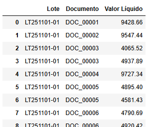
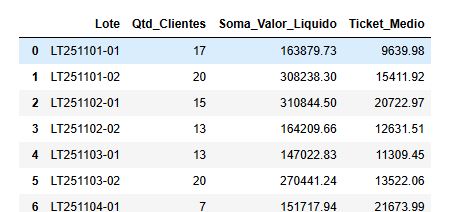
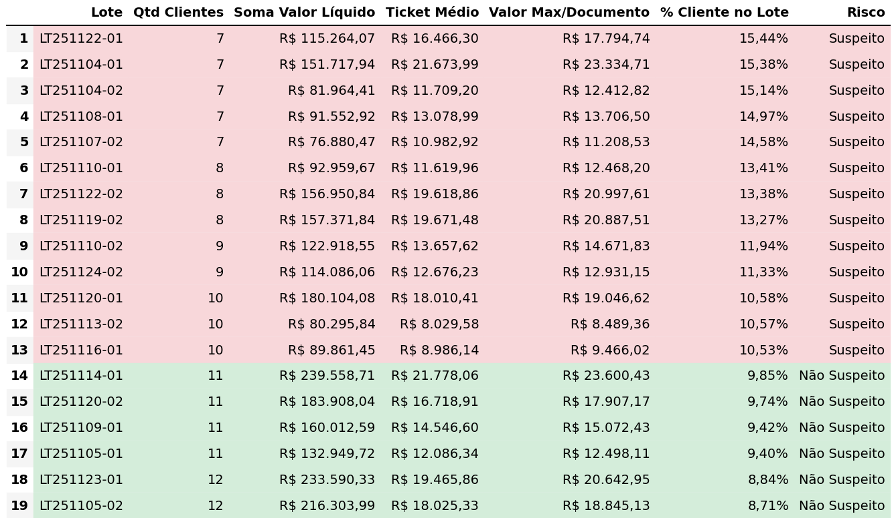

## Financeira [ Procedimento Análise Risco ]

### Case:
Uma empresa do setor Financeiro realiza suas transações e precisa identificar alguma movimentação suspeita para realizar devidos procedimentos de segurança.

### Observação:
Esses dados são totalmente fictícios, assim como esse procedimento que visa somente um exercício de atendimento a uma necessidade hipotética de negócio.

### Planejamento: 
1 - Visibilidade dos dados - análise exploratória 
2 - Construção de agrupamentos e metrificações conforme verificado no passo 1 
3 - Alinhamento das métricas e observaçõe com liderança 
4 - Diagnóstico através da análise de dados 
5 - Elaboração de um plano de ação voltado ao objetivo do Negócio 

**Passo 1: Analise Exploratória** 
Visualização da base geral para identificar variáveis e seus padrões 

**Passo 2: Agrupamento de Documento por Lote** 
Identificação de número de documento iguais no mesmo lote e necessidade de uma visão agrupada 

**Passo 3: Alinhamento das métricas e observaçõe com liderança** 
Após reunião com liderança e observação dos dados, alinhamento de verificar o valor máximo pago ao mesmo documento no lote e verificar a sua representatividade pelo somatório do valor líquido do lote ou número de documento menor que 10 no mesmo lote [ Regrá de Negócio ] - Classificação: Suspeito 

**Passo 4: Diagnóstico através da análise de dados** 
Verificamos uma variação de número de documentos dentro do mesmo lote (Mínimo: 7 / Máximo: 23), assim como valores Máximos de um documento/lote (Mínimo: 8k / Máximo: 23k) assim sinalizando um desvio de comportamento sobre cada transação 

**Passo 5: Elaboração de um plano de ação voltado ao objetivo do Negócio** 
**1 -** Envio de uma análise minunciosa dos casos classificados como suspeito - realizando contato com devidas área Financeira para rastreabilidade de origem 
**2 -** Valores classificados como suspeito, após levantamento minuncioso, será direcionado a liderança com determinados cortes de valores a ser definido pelo negócio para validação antes da efetividade da devida transação 

**Codificação:**[Análise Dados](analise_valores.py) 
